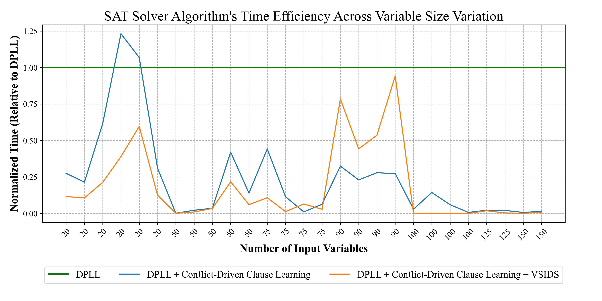
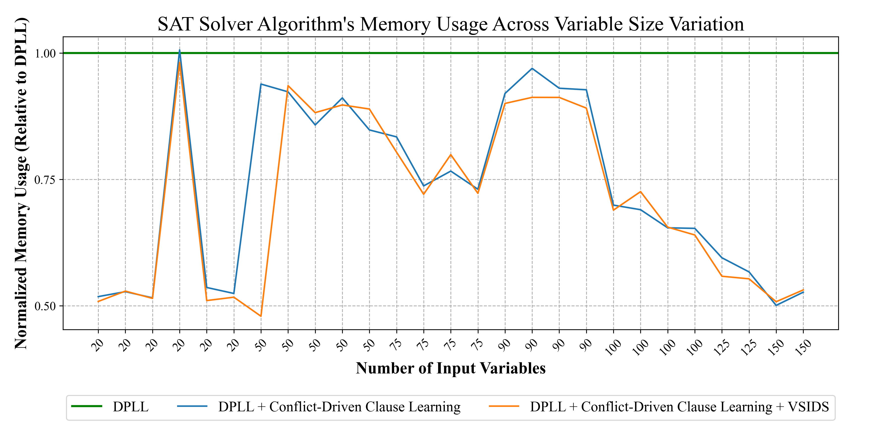

# SAT Solver Implementation with DPLL, CCL, and VSIDS Heuristics

This project implements a SAT solver using the DPLL algorithm with Conflict-Clause-Learning (CCL) and Variable State Independent Decaying Sum (VSIDS) heuristics in C++. It is designed to read a CNF file, solve the Boolean satisfiability problem, and print the results.

It also implements the basic DPLL and basic DPLL with Conflict-Clause-Learning (CCL) for benchmarking.

---

## Directory Structure

- **`DPLL_CCL_VSIDS.cpp`**: Contains DPLL algorithm with Conflict-Clause-Learning and VSIDS heuristics.
- **`DPLL_CCL.cpp`**: Contains DPLL algorithm with Conflict-Clause-Learning.
- **`DPLL.cpp`**: Contains basic DPLL algorithm only.
- **`benchmark_files/`**: This folder contains various CNF files for testing the SAT solver.
- **`benchmark.py`**: This is benchmarking script which compares the time taken and memory usage of the above three SAT solvers.
- **`graph_plot.py`**: Run this python program to plot the graph to visualise the comparison relative to basic DPLL.
- **`images/`**: This folder has benchmarking plots and other supporting images.
- **`run_all.sh`**: This shell script is used to run all cnf files from benchmark_files folder by selecting the required solver out of the three.
- **`DSDA_Project_Report_Group5.pdf`**: This PDF includes detailed documentation on the algorithm, changes in heuristics, results, and analysis.

---

## How to Run

### Prerequisites

- **C++ Compiler:** `g++` (GCC for Linux/macOS, MinGW for Windows)

### Steps

1. Open a terminal or command prompt.

2. Navigate to the project directory:

```bash
   git clone https://github.com/vishalkevat007/SAT-Solver-Implementation.git
   cd SAT-Solver-Implementation
```

3. Compile the three SAT solver using the following command:

```bash
   g++ -std=c++17 -O2 DPLL_CCL_VSIDS.cpp -o DPLL_CCL_VSIDS
   g++ -std=c++17 -O2 DPLL_CCL.cpp -o DPLL_CCL
   g++ -std=c++17 -O2 DPLL.cpp -o DPLL
```

4. Run the SAT solver by providing a CNF file as input:

   Example:
```bash
   ./DPLL_CCL_VSIDS benchmark_files/aim-50-3_4-yes1-4.cnf
```

### Output

The program will print:

- **RESULT**: Indicating whether the result is `SAT` or `UNSAT`.
- **Assignments** (if SAT): Displays variable assignments.
- **Time taken** (if SAT): Displays the time taken to run the algorithm.
- **Memory used** (if SAT): Displays the memory used to run the algorithm.

---

## How to Benchmark

### Prerequisites

- **Python 3.12.3** (with pandas and matplotlib)

### Steps

1. In the same directory and terminal, execute the following:

```bash
   python benchmark.py
```

2. The above python code generates the benchmarking csv file. To plot the results from this csv file, run:

```bash
   python graph_plot.py
```

3. Graphs will be saved in ./images folder.

---

## Benchmarking Results

|Benchmark            |Variables|Clauses|Result|DPLL(s)   |CCL(s)  |VSIDS(s)|DPLL(KB)|CCL(KB)|VSIDS(KB)|
|---------------------|---------|-------|------|----------|--------|--------|--------|-------|---------|
|uf20-0941.cnf        |20       |91     |SAT   |0.000447  |0.00014 |6e-05   |3584    |2020   |2080     |
|uf20-0771.cnf        |20       |91     |SAT   |0.000228  |0.000233|0.000132|3736    |2084   |2020     |
|uf20-0114.cnf        |20       |91     |SAT   |0.00048   |0.000121|9.7e-05 |3676    |2072   |2020     |
|uf20-0681.cnf        |20       |91     |SAT   |0.000102  |0.000132|4.8e-05 |2076    |2024   |2084     |
|uf20-0518.cnf        |20       |91     |SAT   |0.000193  |0.000119|4.2e-05 |2068    |2028   |2020     |
|uf20-0159.cnf        |20       |91     |SAT   |0.000948  |0.000188|9.5e-05 |3540    |2072   |2072     |
|aim-50-2_0-yes1-4.cnf|50       |100    |SAT   |0.279313  |0.000404|0.000372|3752    |2024   |2072     |
|aim-50-3_4-yes1-4.cnf|50       |170    |SAT   |0.01658   |0.000344|0.000148|3800    |3552   |3444     |
|uuf50-0152.cnf       |50       |218    |UNSAT |0.115777  |0.003123|0.003096|4112    |3508   |3548     |
|uuf50-063.cnf        |50       |218    |UNSAT |0.035417  |0.003875|0.001615|4076    |3464   |3580     |
|uuf50-057.cnf        |50       |218    |UNSAT |0.011158  |0.003834|0.001831|3852    |3624   |3444     |
|uf75-011.cnf         |75       |325    |SAT   |0.340011  |0.029042|0.003256|4864    |3620   |3556     |
|uf75-01.cnf          |75       |325    |SAT   |0.005106  |0.001843|0.000492|4396    |3468   |3640     |
|uf75-012.cnf         |75       |325    |SAT   |0.454156  |0.003508|0.02298 |4960    |3668   |3772     |
|uuf75-013.cnf        |75       |325    |UNSAT |0.806641  |0.039939|0.017942|4916    |3488   |3488     |
|flat30-100.cnf       |90       |300    |SAT   |0.000849  |0.000259|0.000587|3932    |3536   |3544     |
|flat30-31.cnf        |90       |300    |SAT   |0.00093   |0.000255|0.000496|3776    |3516   |3624     |
|flat30-83.cnf        |90       |300    |SAT   |0.000887  |0.000236|0.000774|3800    |3688   |3500     |
|flat30-45.cnf        |90       |300    |SAT   |0.001033  |0.000222|0.000447|3868    |3628   |3548     |
|uf100-01.cnf         |100      |430    |SAT   |6.372587  |0.128698|0.004962|5800    |3940   |3864     |
|uf100-035.cnf        |100      |430    |SAT   |2.548118  |0.103418|0.001373|5784    |3884   |3928     |
|uf100-0105.cnf       |100      |430    |SAT   |0.868607  |0.085036|0.001133|5388    |3876   |4008     |
|uf100-046.cnf        |100      |430    |SAT   |25.081609 |0.122506|0.003873|6208    |3788   |3868     |
|uuf125-027.cnf       |125      |538    |UNSAT |73.019178 |1.041297|0.888688|6812    |4012   |3664     |
|uuf125-064.cnf       |125      |538    |UNSAT |70.811885 |0.955409|0.159989|6304    |3844   |3744     |
|uuf150-067.cnf       |150      |645    |UNSAT |523.537244|4.714775|2.731648|7952    |4208   |4008     |
|uf150-01.cnf         |150      |645    |SAT   |52.678817 |0.236098|0.039167|8020    |4128   |4024     |


### Time Efficiency Comparison


### Memory Usage Comparison


---

## Full Report

For detailed analysis, benchmarking methodology, and results, refer to the [Project Report (PDF)](DSDA_Project_Report_Group5.pdf).

---

## Contributors
- [Vishal Kevat](https://github.com/vishalkevat007)  
- [Adrija Chakraborty](https://github.com/Adrija-debug)